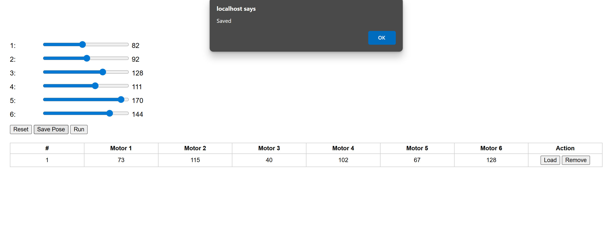
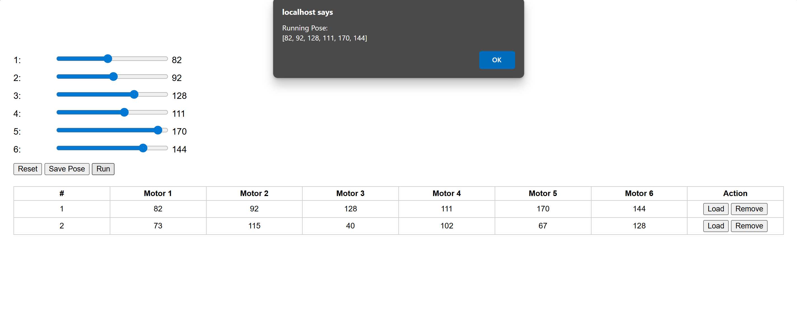

# AutoPose Control Interface

A simple web-based controller interface to save and replay robot motor poses using sliders. Built with HTML, CSS, JavaScript, PHP, and MySQL.

## Features

- Adjust 6 motor values using sliders.
- Save the current pose to a MySQL database.
- View saved poses in a dynamic table.
- Load a previous pose to the sliders.
- Run a selected pose (simulated).
- Remove poses from the database.

## Screenshots

After saving a pose:



After running a pose:



## How to Run

1. Install **XAMPP** or any local server with PHP & MySQL support.
2. Copy the entire project folder (`RAC`) to `C:/xampp/htdocs/`.
3. Open **phpMyAdmin** and create a database:
   - Name: `robot_db`
   - Table: `poses`  
   - Columns:
     - `id` INT AUTO_INCREMENT PRIMARY KEY  
     - `motor1` to `motor6` INT  
     - `status` TINYINT
4. Start **Apache** and **MySQL** from the XAMPP control panel.
5. Open your browser and visit:  
   `http://localhost/RAC/index.html`

## File Structure
````
RAC/
├── index.html # Main interface with sliders
├── save_pose.php # Saves slider values to DB
├── get_run_pose.php # Loads pose for sliders
├── update_status.php # Handles 'Run' status logic
├── db.php # Database connection
├── screenshot.png # Saved pose example
└── screenshot0.png # Run pose example
